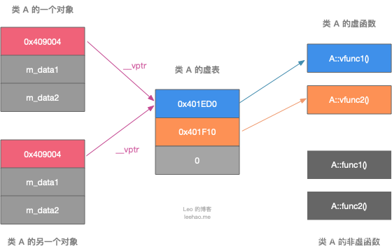

[TOC]

环境：

Ubuntu 18.04

Clion 2019.3

参考：

[阿秀的《**逆袭进大厂**》系列](https://mp.weixin.qq.com/mp/appmsgalbum?__biz=Mzg2MDU0ODM3MA==&action=getalbum&album_id=1728595536544366595&scene=173&from_msgid=2247485655&from_itemidx=1&count=3&nolastread=1#wechat_redirect)

[InterviewGuide/知识储备/C&C++.md](https://github.com/forthespada/InterviewGuide/blob/main/%E7%9F%A5%E8%AF%86%E5%82%A8%E5%A4%87/C&C++.md)

主要参考以上系列文章，感谢其博主的无私分享，在此基础上加上了自己的理解和其他网上相关讲解，并尽可能地给出代码示例与结果。


### 1、在main执行之前和之后执行的代码可能是什么？

**main函数执行之前**，主要就是初始化系统相关资源：

- 设置栈指针

- 初始化静态static变量和global全局变量，即.data段的内容

- 将未初始化部分的全局变量赋初值：数值型short，int，long等为0，bool为false，指针为nullptr等等，即.bss段的内容

- 全局对象初始化，在main之前调用构造函数

- 将main函数的参数argc，argv等传递给main函数，然后才真正运行main函数
  

**main函数执行之后**：

- 全局对象的析构函数会在main函数之后执行；
- 可以用 **atexit** 注册一个函数，它会在main 之后执行;

**示例代码：**

```cpp
#include <iostream>

class Test{
public:
    explicit Test(int num){
        m_num = num;
        std::cout << "Test 构造函数 .. " << m_num << std::endl;
    }
    ~Test(){
        std::cout << "Test 析构函数 .. " << m_num << std::endl;
    }
    void show(){
        std::cout << "Test show函数 .. " << m_num << std::endl;
    }

public:
    int m_num;
};

Test g_test(1);

void fn1()
{
    std::cout << "calls fn1" << std::endl;
}

int main() {

    atexit(fn1);

    std::cout << "main int" << std::endl;

    std::cout << "=======" << std::endl;
    g_test.show();

    std::cout << "=======" << std::endl;
    Test test(2);
    test.show();

    std::cout << "main out" << std::endl;
    return 0;
}
```


### 2、C/C++结构体内存对齐问题

内存中存放数据是为了给CPU使用，CPU访问内存数据时会受到地址总线宽度的限制，也就是一次能从内存中拿多少数据到CPU（这里忽略CPU高速缓存）。而且，**CPU从内存中获取数据时起始地址必须是地址总线宽度的倍数**

a. 内存对齐是指，变量地址的对齐，而不是变量大小的对齐。变量地址的对齐是指变量地址 对 变量大小求模为0。

b. 结构体中每一个成员都要求是内存对齐的。

c. 结构体中的数组，按数组的类型对齐。例如：char c[5] 按 char 类型大小计算对齐，double d[22] 按 double 类型大小计算对齐。

- 结构体内成员按照声明顺序存储，第一个成员地址和整个结构体地址相同。
- 未特殊说明时，按结构体中size最大的成员对齐（若有double成员，按8字节对齐。）

**代码示例：**

```cpp
#include <iostream>

#pragma pack(4)  /// 注意点 1
struct TestA {
    char a; // 1
    char b; // 1
    double c; // 8
    int d;  //4
};
#pragma pack() /// 注意点 2

struct TestB {
    char h[6]; //6
    char i[4]; //4
    int j;  //4
    double k; // 8

};


int main() {
    std::cout << "Hello, World!" << std::endl;
    TestA testA{};
    TestB testB{};
    // 64位电脑  不通过 #pragma pack(4)  设置对齐 TestA 中 a,b 一起占 8 字节; c  8 字节 ;d 占 8 字节
    std::cout << "sizeof(testA) = " << sizeof(testA) << std::endl;
    // 64位电脑  不通过 #pragma pack(4)  设置对齐 testB 中 h[6] 占 8 字节; i[4] 与 j 一起占 8 字节, k  8 字节
    std::cout << "sizeof(testB) = " << sizeof(testB) << std::endl;

    return 0;
}
```


不通过 #pragma pack(4)  设置对齐 结果如下


通过 #pragma pack(4)  设置对齐 结果如下


**注意点 1:**

pragma pack(4) 设置4字节对齐， TestA 中 a,b 一起占 4 字节; c  8 字节 ;d 占 4 字节

**注意点 2:**

#pragma pack() 恢复内存按照默认字节对齐（8字节），\#pragma pack(show)  可以显示当前内存对齐的字节数

**注意：**

最好在通过 #pragma pack(4)  设置了哪些结构体需要对齐后，不再指定对齐时使用  #pragma pack()  恢复内存按照默认字节对齐，不然有可能会导致其他地方出问题。有过这样的经历，未使用  #pragma pack()  恢复内存按照默认字节对齐，导致ofstream写入数据时报错


c++11以后引入两个关键字 [alignas](https://zh.cppreference.com/w/cpp/language/alignas)与 [alignof](https://zh.cppreference.com/w/cpp/language/alignof)。其中`alignof`可以计算出类型的对齐方式，`alignas`可以指定结构体的对齐方式。

`alignas`在某些情况下要注意使用：

1、若`alignas`小于自然对齐的最小单位，则被忽略。

```cpp
struct alignas(2) Info2 {
  uint8_t a;
  uint32_t b;
  uint8_t c;
};
std::cout << sizeof(Info2) << std::endl;   // 12  4 + 4 + 4  alignas 被忽略
std::cout << alignof(Info2) << std::endl;  // 4
```

2、单字节对齐的方式，使用`alignas`是无效的。应该使用`#pragma pack(push,1)`


### 3、指针和引用的区别？


- 指针是一个变量，存储的是一个地址，引用跟原来的变量实质上是同一个东西，是原变量的别名
- 指针可以有多级，引用只有一级
- 指针可以为空，引用不能为NULL且在定义时必须初始化
- 指针在初始化后可以改变指向，而引用在初始化之后不可再改变
- sizeof指针得到的是本指针的大小，sizeof引用得到的是引用所指向变量的大小
- 当把指针作为参数进行传递时，也是将实参的一个拷贝传递给形参，两者指向的地址相同，但不是同一个变量，在函数中改变这个变量的指向不影响实参，而引用却可以。
- 引用本质是一个指针，同样会占4字节内存；指针是具体变量，需要占用存储空间（具体情况还要具体分析）。
- 引用在声明时必须初始化为另一变量，一旦出现必须为typename refname &varname形式；指针声明和定义可以分开，可以先只声明指针变量而不初始化，等用到时再指向具体变量。
- 引用一旦初始化之后就不可以再改变（变量可以被引用为多次，但引用只能作为一个变量引用）；指针变量可以重新指向别的变量。
- 不存在指向空值的引用，必须有具体实体；但是存在指向空值的指针。

```cpp
#include <iostream>

void testPointer1(int* p) {

    std::cout << "testPointer1 *p = " << *p << std::endl;
    std::cout << "testPointer1 p = " << p << std::endl;
	int a = 12;
	p = &a;
    std::cout << "testPointer1 *p = " << *p << std::endl;
    std::cout << "testPointer1 p = " << p << std::endl;

}

void testPointer2(int* p) {

    std::cout << "testPointer2 *p = " << *p << std::endl;
    std::cout << "testPointer2 p = " << p << std::endl;
    int a = 12;
    *p = a; // 改变指向的内容
    std::cout << "testPointer2 *p = " << *p << std::endl;
    std::cout << "testPointer2 p = " << p << std::endl;

}

void testReference(int& p) {
	int a = 12;
	p = a;

}

int main() {
    std::cout << "Hello, World!" << std::endl;
    int a = 1024;
    int* b = &a;
    std::cout << "---testPointer1---" << std::endl;
    std::cout << "b = " << b << std::endl;
    testPointer1(b);//指针作为参数进行传递时，也是将实参的一个拷贝传递给形参，两者指向的地址相同，但不是同一个变量
    std::cout << "a = " << a << std::endl;
    std::cout << "*b = " << *b << std::endl;
    std::cout << "b = " << b << std::endl;

    std::cout << "---testPointer2---" << std::endl;
    testPointer2(b);
    std::cout << "a = " << a << std::endl;
    std::cout << "*b = " << *b << std::endl;
    std::cout << "b = " << b << std::endl;

    a = 10;
    std::cout << "---testReference---" << std::endl;
    testReference(a);
    std::cout << "a = " << a <<  std::endl;


    return 0;
}
```


### 4、堆和栈的区别？

- **申请方式不同**：
  - 栈由系统自动分配；
  - 堆是自己申请和释放的。
- **申请大小限制不同：**
  - 栈顶和栈底是之前预设好的，栈是向栈底扩展，大小固定，可以通过ulimit -a查看，由ulimit -s修改；
  - 堆向高地址扩展，是不连续的内存区域，大小可以灵活调整。
- **申请效率不同**：
  - 栈由系统分配，速度快，不会有碎片；
  - 堆由程序员分配，速度慢，且会有碎片。

栈空间默认是4M, 堆区一般是 1G - 4G

|                  | **堆**                                                       | **栈**                                                       |
| ---------------- | ------------------------------------------------------------ | ------------------------------------------------------------ |
| **管理方式**     | 堆中资源由程序员控制（容易产生memory leak）                  | 栈资源由编译器自动管理，无需手工控制                         |
| **内存管理机制** | 系统有一个记录空闲内存地址的链表，当系统收到程序申请时，遍历该链表，寻找第一个空间大于申请空间的堆结点，删 除空闲结点链表中的该结点，并将该结点空间分配给程序（大多数系统会在这块内存空间首地址记录本次分配的大小，这样delete才能正确释放本内存空间，另外系统会将多余的部分重新放入空闲链表中） | 只要栈的剩余空间大于所申请空间，系统为程序提供内存，否则报异常提示栈溢出。<font color=red >（这一块理解一下链表和队列的区别，不连续空间和连续空间的区别，应该就比较好理解这两种机制的区别了）</font> |
| **空间大小**     | 堆是不连续的内存区域（因为系统是用链表来存储空闲内存地址，自然不是连续的），堆大小受限于计算机系统中有效的虚拟内存（32bit 系统理论上是4G），所以堆的空间比较灵活，比较大 | 栈是一块连续的内存区域，大小是操作系统预定好的，windows下栈大小是2M（也有是1M，在 编译时确定，VC中可设置） |
| **碎片问题**     | 对于堆，频繁的new/delete会造成大量碎片，使程序效率降低。（内存池、对象池） | 对于栈，它是一个先进后出的队列，进出一一对应，不会产生碎片。 |
| **生长方向**     | 堆向上，向高地址方向增长。                                   | 栈向下，向低地址方向增长。                                   |
| **分配方式**     | 堆都是动态分配                                               | 栈有静态分配和动态分配，静态分配由编译器完成（如局部变量分配），动态分配由alloca函数分配，但栈的动态分配的资源由编译器进行释放，无需程序员实现。 |
| **分配效率**     | 堆由C/C++函数库提供，机制很复杂。所以堆的效率比栈低很多。    | 栈是其系统提供的数据结构，计算机在底层对栈提供支持，分配专门 寄存器存放栈地址，栈操作有专门指令。 |

> [《C++中堆（heap）和栈(stack)的区别》](https://blog.csdn.net/qq_34175893/article/details/83502412)

> [一步一步学linux操作系统: 17 内存管理_进程内存空间布局](https://blog.csdn.net/leacock1991/article/details/107169818)
>
> [一步一步学linux操作系统: 18 内存管理_内存映射与分段、分页机制](https://blog.csdn.net/leacock1991/article/details/107217985)
>
> [一步一步学linux操作系统: 19 内存管理_进程的虚拟内存空间的管理](https://blog.csdn.net/leacock1991/article/details/107328814)
>
> [一步一步学linux操作系统: 20 内存管理_NUMA 方式物理内存管理_节点、区域、页以及伙伴系统（Buddy System）](https://blog.csdn.net/leacock1991/article/details/107351173)
>
> [简单可扩展对象池C++实现](https://blog.csdn.net/leacock1991/article/details/114842733)


### 5、讲讲虚函数表？

每个包含了虚函数的类都包含一个虚表。当一个类（A）继承另一个类（B）时，类 A 会继承类 B 的函数的调用权。所以如果一个基类包含了虚函数，那么其继承类也可调用这些虚函数，换句话说，一个类继承了包含虚函数的基类，那么这个类也拥有自己的虚表。

类 A 包含虚函数vfunc1，vfunc2，由于类 A 包含虚函数，故类 A 拥有一个虚表。

```cpp
class A {
public:
    virtual void vfunc1();
    virtual void vfunc2();
    void func1();
    void func2();
private:
    int m_data1, m_data2;
};
```



虚表是一个指针数组，其元素是虚函数的指针，每个元素对应一个虚函数的函数指针。需要指出的是，普通的函数即非虚函数，其调用并不需要经过虚表，所以虚表的元素并不包括普通函数的函数指针。虚虚函数指针的赋值发生在编译器的编译阶段，也就是说在代码的编译阶段，虚表就可以构造出来了。


**虚表指针**
虚表是属于类的，而不是属于某个具体的对象，一个类只需要一个虚表即可。同一个类的所有对象都使用同一个虚表。

为了指定对象的虚表，对象内部包含一个虚表的指针，来指向自己所使用的虚表。为了让每个包含虚表的类的对象都拥有一个虚表指针，编译器在类中添加了一个指针，*__vptr，用来指向虚表。这样，当类的对象在创建时便拥有了这个指针，且这个指针的值会自动被设置为指向类的虚表。

**动态绑定**

```cpp
class A {
public:
    virtual void vfunc1();
    virtual void vfunc2();
    void func1();
    void func2();
private:
    int m_data1, m_data2;
};

class B : public A {
public:
    virtual void vfunc1();
    void func1();
private:
    int m_data3;
};

class C: public B {
public:
    virtual void vfunc2();
    void func2();
private:
    int m_data1, m_data4;
};
```

类 A 是基类，类 B 继承类 A，类 C 又继承类 B。


由于这三个类都有虚函数，故编译器为每个类都创建了一个虚表，即类 A 的虚表（A vtbl），类 B 的虚表（B vtbl），类 C 的虚表（C vtbl）。类 A，类 B，类 C 的对象都拥有一个虚表指针，<font color=red >`*__vptr`</font>，用来指向自己所属类的虚表。

- 类 A 包括两个虚函数，故 A vtbl 包含两个指针，分别指向A::vfunc1()和A::vfunc2()。
- 类 B 继承于类 A，故类 B 可以调用类 A 的函数，但由于类 B 重写了B::vfunc1()函数，故 B vtbl 的两个指针分别指向B::vfunc1()和A::vfunc2()。
- 类 C 继承于类 B，故类 C 可以调用类 B 的函数，但由于类 C 重写了C::vfunc2()函数，故 C vtbl 的两个指针分别指向B::vfunc1()（指向继承的最近的一个类的函数）和C::vfunc2()。

对象的虚表指针用来指向自己所属类的虚表，虚表中的指针会指向其继承的最近的一个类的虚函数

C++中**虚函数表位于只读数据段（.rodata），也就是C++内存模型中的常量区；而虚函数则位于代码段（.text），也就是C++内存模型中的代码区。**

> [C++虚函数表剖析](https://blog.csdn.net/lihao21/article/details/50688337)


### 6、new / delete 与 malloc / free的异同?

**相同点**

- 都可用于内存的动态申请和释放

**不同点**

- 前者是C++运算符，后者是C/C++语言标准库函数

  ```cpp
  void* malloc(size_t size)//参数代表字节个数
  void free(void* pointer)//参数代表内存地址
  ```

- new自动计算要分配的空间大小，malloc需要手工计算

- malloc返回类型为void*,必须强制类型转换对应类型指针，new则直接返回对应类型指针；

- malloc开辟内存时返回内存地址要检查判空，因为若它可能开辟失败会返回NULL；new则不用判断，因为内存分配失败时，它会抛出异常bac_alloc,可以使用异常机制；

- malloc/free为函数只是开辟空间并释放，new/delete则不仅会开辟空间，并调用构造函数和析构函数进行初始化和清理

- new是封装了malloc，直接free不会报错，但是这只是释放内存，而不会析构对象

> [new/delete与malloc/free的区别与联系详解！](https://blog.csdn.net/weibo1230123/article/details/81980889)
>
> [浅谈 C++ 中的 new/delete 和 new[]/delete[]](https://blog.csdn.net/hazir/article/details/21413833?utm_medium=distribute.pc_relevant.none-task-blog-2%7Edefault%7EBlogCommendFromMachineLearnPai2%7Edefault-2.control&dist_request_id=&depth_1-utm_source=distribute.pc_relevant.none-task-blog-2%7Edefault%7EBlogCommendFromMachineLearnPai2%7Edefault-2.control)


delete只会调用一次析构函数。

delete[]会调用数组中每个元素的析构函数。


### 7、宏定义和函数有何区别？

- 宏在编译时完成替换，之后被替换的文本参与编译，相当于直接插入了代码，运行时不存在函数调用，执行起来更快；函数调用在运行时需要跳转到具体调用函数。
- 宏定义属于在结构中插入代码，没有返回值；函数调用具有返回值。
- 宏定义参数没有类型，不进行类型检查；函数参数具有类型，需要检查类型。
- 宏定义不要在最后加分号。

### 8、strlen和sizeof区别？

- sizeof是运算符，并不是函数，结果在编译时得到而非运行中获得；strlen是字符处理的库函数。
- sizeof参数可以是任何数据的类型或者数据（sizeof参数不退化）；strlen的参数只能是字符指针且结尾是'\0'的字符串。
- 因为sizeof值在编译时确定，所以不能用来得到动态分配（运行时分配）存储空间的大小。

```cpp
#include <iostream>
#include <cstring>

int main() {
    const char* str = "Hello";
    int size = sizeof(str); // 取的是指针str的长度，是8
    std::cout << "size = " << size << std::endl;
    int len =  strlen(str); // 取的是这个字符串的长度，不包含结尾的 \0。大小是5
    std::cout << "len = " << len << std::endl;
    return 0;
}
```

```
size = 8
len = 5
```


### 9、常量指针和指针常量区别？

- 指针常量是一个指针，读成常量的指针，指向一个只读变量。如int const *p或const int *p。底层const，指针所指的对象是个常量
- 常量指针是一个不能给改变指向的指针。指针是个常量，不能中途改变指向，如int *const p。顶层const,指针本身是个常量

```cpp
#include <iostream>

int main() {
    std::cout << "Hello, World!" << std::endl;
    int a,b;
    int * const p1=&a; //常量指针 不能中途改变指向
    *p1=9;//操作成功
    //p=&b;//操作错误
    const int *p2=&a; // 指针常量 指向一个只读变量
    //那么分为一下两种操作
    //*p2=9;//操作错误
    p2=&b;//操作成功
    return 0;
}
```

### 10、数组 a和&a有什么区别？

```cpp
假设数组int a[10];
int (*p)[10] = &a;
```

- a是数组名，是数组首元素地址，+1表示地址值加上一个int类型的大小（4字节）。如果a的值是0x7ffc637bded0，加1操作后变为0x7ffc637bded4。*(a + 1) == a[1]。
- &a是数组的指针，其类型为int (*)[10]（数组指针），其加1时，系统会认为是数组首地址加上整个数组的偏移（10个int型变量），值为数组a尾元素后一个元素的地址。 0x7ffc637bded0 -> 0x7ffc637bdef8
- 若(int *)p ，此时输出 *p时，其值为a[0]的值，因为被转为int *类型，解引用时按照int类型大小来读取。

```cpp
#include <iostream>

int main() {
   
    int a[10] = {0,1,2,3,4,5,6,7,8,9};
    int (*p)[10] = &a;
    printf("address: a = %p\n",a);
    printf("address: a + 1 = %p\n",a + 1);
    printf("data: *(a + 1) = %d  a[1] = %d\n",*(a + 1),a[1]);

    printf("address: p = %p\n",p);
    printf("address: p + 1 = %p\n",p + 1);
    printf("address: a + 10 = %p\n",a + 10);

    printf("data: *(int *)p  = %d  a[0] = %d\n",*(int *)p ,a[0]);
    return 0;
}
```


### 11、迭代器失效问题

当删除一个STL容器(比如map, vector)中的某个元素时， 会引起迭代器失效。

**序列式容器迭代器失效**

对于序列式容器，例如vector、deque；由于序列式容器是组合式容器，当当前元素的iterator被删除后，其后的所有元素的迭代器都会失效，这是因为vector，deque都是连续存储的一段空间，所以当对其进行erase操作时，其后的每一个元素都会向前移一个位置。

```cpp
#include <iostream>
#include<vector>
using namespace std;

void VectorTest1()
{
    vector<int> vec;
    for (int i = 0; i < 8; i++)
    {
        vec.push_back(i);
    }
    vector<int>::iterator it;
    cout << sizeof(it) << endl;
    for (it = vec.begin(); it != vec.end(); it++)  // 已经失效的迭代器不能进行++操作，所以程序中断了
    {
        if (*it>2)
            vec.erase(it);//此处会发生迭代器失效
    }
    for (it = vec.begin(); it != vec.end(); it++)
        cout << *it << " ";
    cout << endl;
}

void VectorTest2()
{
    vector<int> vec;
    for (int i = 0; i < 8; i++)
    {
        vec.push_back(i);
    }
    vector<int>::iterator it;
    cout << sizeof(it) << endl;
    for (it = vec.begin(); it != vec.end();)  // 不在这里++
    {
        if (*it>2)
            it = vec.erase(it); //vector的erase操作可以返回下一个有效的迭代器
        else
            it++;
    }
    for (it = vec.begin(); it != vec.end(); it++)
        cout << *it << " ";
    cout << endl;
}

int main() {

    //VectorTest1(); //  Process finished with exit code 139 (interrupted by signal 11: SIGSEGV)
    VectorTest2();
    return 0;
}
```

VectorTest1 演示了不考虑迭代器失效程序会出现错误，VectorTest2考虑了迭代器失效并进行了相应处理

- 已经失效的迭代器不能进行++操作
- vector的erase操作可以返回下一个有效的迭代器

返回：

```
8
0 1 2 
Process finished with exit code 0
```


**关联式容器迭代器失效**

对于关联容器(如map, set,multimap,multiset)，删除当前的iterator，仅仅会使当前的iterator失效，只要在erase时，递增当前iterator即可。因为map之类的容器，使用了红黑树来实现，插入、删除一个结点不会对其他结点造成影响。erase迭代器只是被删元素的迭代器失效，但是返回值为void，所以要采用erase(iter++)的方式删除迭代器。 

```cpp
#include <iostream>
#include <map>
using namespace std;

void MapTest1()
{
    map<int, int>m;
    for (int i = 0; i < 50; i++)
    {
        m.insert(make_pair(i, i + 1));
    }
    map<int, int>::iterator it;
    for (it = m.begin(); it != m.end(); it++) // 不能进行++
    {
        if ( it->first % 2 == 0 )
            m.erase(it); // 迭代器先失效
    }
    for (it = m.begin(); it != m.end();it++)
    {
        cout << it->first << " ";
    }
    cout << endl;
}

void MapTest2()
{
    map<int, int>m;
    for (int i = 0; i < 50; i++)
    {
        m.insert(make_pair(i, i + 1));
    }
    map<int, int>::iterator it;
    for (it = m.begin(); it != m.end(); )
    {
        if ( it->first % 2 == 0 )
            m.erase(it++); // 这句话分三步走，先把iter传值到erase里面，然后iter自增，然后执行erase,所以iter在失效前已经自增了。
        else
            it++;
    }
    for (it = m.begin(); it != m.end();it++)
    {
        cout << it->first << " ";
    }
    cout << endl;
}

int main() {
    //MapTest1(); //
    MapTest2();
    return 0;
}
```

ps: MapTest1测试时 在未出现程序运行失败的情况，环境如下

```
leacock@leacock-virtual-machine:~$ g++ --version
g++ (Ubuntu 7.5.0-3ubuntu1~18.04) 7.5.0
Copyright (C) 2017 Free Software Foundation, Inc.
This is free software; see the source for copying conditions.  There is NO
warranty; not even for MERCHANTABILITY or FITNESS FOR A PARTICULAR PURPOSE.
```

> [关于迭代器失效的几种情况](https://blog.csdn.net/qq_37964547/article/details/81160505)


### 12、C++中struct和class的区别

**相同点**

- 两者都拥有成员函数、公有和私有部分
- 任何可以使用class完成的工作，同样可以使用struct完成

**不同点**

- 两者中如果不对成员不指定公私有，struct默认是公有的，class则默认是私有的
- class默认是private继承，而struct模式是public继承
- class 可以使用模板，而 struct 不能

**引申**：C++和C的struct区别

- C语言中：struct是用户自定义数据类型（UDT）；C++中struct是抽象数据类型（ADT），支持成员函数的定义，（C++中的struct能继承，能实现多态）
- C中struct是没有权限的设置的，且struct中只能是一些变量的集合体，可以封装数据却不可以隐藏数据，而且成员**不可以是函数**
- C++中，struct增加了访问权限，且可以和类一样有成员函数，成员默认访问说明符为public（为了与C兼容）
- struct作为类的一种特例是用来自定义数据结构的。一个结构标记声明后，在C中必须在结构标记前加上struct，才能做结构类型名（除：typedef struct class{};）;C++中结构体标记（结构体名）可以直接作为结构体类型名使用，此外结构体struct在C++中被当作类的一种特例


> [struct结构在C和C++中的区别](https://blog.csdn.net/mm_hh/article/details/70456240)
>
> [C++中Struct与Class的区别与比较](https://blog.csdn.net/weixin_39640298/article/details/84349171)


### 13、define宏定义和const的区别

**编译阶段**

- define是在编译的**预处理**阶段起作用，而const是在编译、运行的时候起作用

**安全性**

- define只做替换，不做类型检查和计算，也不求解，容易产生错误，一般最好加上一个大括号包含住全部的内容，要不然很容易出错
- const常量有数据类型，编译器可以对其进行类型安全检查

**内存占用**

- define只是将宏名称进行替换，在内存中会产生多分相同的备份。const在程序运行中只有一份备份，且可以执行常量折叠，能将复杂的的表达式计算出结果放入常量表
- 宏替换发生在编译阶段之前，属于文本插入替换；const作用发生于编译过程中。
- 宏不检查类型；const会检查数据类型。
- 宏定义的数据没有分配内存空间，只是插入替换掉；const定义的变量只是值不能改变，但要分配内存空间。


### 14、C++中const和static的作用

**static**

- 不考虑类的情况
  - 隐藏。所有不加static的全局变量和函数具有全局可见性，可以在其他文件中使用，加了之后只能在该文件所在的编译模块中使用
  - 默认初始化为0，包括未初始化的全局静态变量与局部静态变量，都存在全局未初始化区
  - 静态变量在函数内定义，始终存在，且只进行一次初始化，具有记忆性，其作用范围与局部变量相同，函数退出后仍然存在，但不能使用
- 考虑类的情况
  - static成员变量：只与类关联，不与类的对象关联。定义时要分配空间，不能在类声明中初始化，必须在类定义体外部初始化，初始化时不需要标示为static；可以被非static成员函数任意访问。
  - static成员函数：不具有this指针，无法访问类对象的非static成员变量和非static成员函数；**不能被声明为const、虚函数和volatile**；可以被非static成员函数任意访问

**const**

- 不考虑类的情况

  - const常量在定义时必须初始化，之后无法更改

  - const形参可以接收const和非const类型的实参，例如

    ```
    // i 可以是 int 型或者 const int 型
    void fun(const int& i){
    	//...
    }
    ```

- 考虑类的情况

  - const成员变量：不能在类定义外部初始化，只能通过构造函数初始化列表进行初始化，并且必须有构造函数；不同类对其const数据成员的值可以不同，所以不能在类中声明时初始化
  - const成员函数：const对象不可以调用非const成员函数；非const对象都可以调用；不可以改变非mutable（用该关键字声明的变量可以在const成员函数中被修改）数据的值


### 15、C++的顶层const和底层const

**概念区分**

- **顶层**const：指的是const修饰的变量**本身**是一个常量，无法修改，指的是指针，就是 * 号的右边
- **底层**const：指的是const修饰的变量**所指向的对象**是一个常量，指的是所指变量，就是 * 号的左边

**举个例子**

```cpp
int a = 10;
int* const b1 = &a;        //顶层const，b1本身是一个常量
const int* b2 = &a;        //底层const，b2本身可变，所指的对象是常量
const int b3 = 20; 		   //顶层const，b3是常量不可变
const int* const b4 = &a;  //前一个const为底层，后一个为顶层，b4不可变
const int& b5 = a;		   //用于声明引用变量，都是底层const
```

**区分作用**

- 执行对象拷贝时有限制，常量的底层const不能赋值给非常量的底层const
- 使用命名的强制类型转换函数const_cast时，只能改变运算对象的底层const

```cpp
const int a;
int const a;
const int *a;
int *const a;
```

- int const a和const int a均表示定义常量类型a。
- const int *a，其中a为指向int型变量的指针，const在 * 左侧，表示a指向不可变常量。(看成const (*a)，对引用加const)
- int *const a，依旧是指针类型，表示a为指向整型数据的常指针。(看成const(a)，对指针const)

> [C++的顶层const和底层const浅析](https://blog.csdn.net/qq_37059483/article/details/78811231)
>
> C++Primer 中文版 （第5版） P57 2.4.3 顶层const


### 16、final和override关键字的作用

这两个都是C++11的新特性

C++11的关键字final有两个用途。第一，它阻止了从类继承；第二，阻止一个虚函数的重载。

当在父类中使用了虚函数时候，需要在某个子类中对这个虚函数进行重写，这时加上override关键字可以指定子类的这个虚函数是重写的父类的，既可以明确表明此函数是重写还可以减少一些不小心写错函数名导致的问题

**final修饰类**：

直接在类名称后面使用关键字final，意味着继承该类会导致编译错误

**final修饰函数**

将方法标记为final，意味着无法在子类中重写该方法。final关键字至于方法参数列表后面。

```cpp
#include <iostream>

class Base
{
    virtual void print();
};

void Base::print() {
    std::cout << "Base::print" << std::endl;
}


class A : public Base
{
    void print() final; // final修饰函数, print 被override并且是最后一个override，在其子类中不可以重写
};

void A::print() {
    std::cout << "A::print" << std::endl;
}

class B final : A // final修饰类 指明B是不可以被继承的
{
    void print() override; // error: overriding final function ‘virtual void A::print()’
};

class C : B // error: cannot derive from ‘final’ base ‘B’ in derived type ‘C’
{
};

int main() {
    std::cout << "Hello, World!" << std::endl;
    return 0;
}
```


### 17、初始化和赋值的区别

- 对于简单类型来说，初始化和赋值没什么区别
- 对于类和复杂数据类型来说，这两者的区别就大了，举例如下：

```cpp
#include <iostream>
class A{
public:
    int num1{};
    int num2{};
public:
    explicit A(int a=0, int b=0):num1(a),num2(b){
        printf("A(int a=0, int b=0):num1(a),num2(b) num1 = %d , num2 = %d\n" ,a,b);
    };
    A(const A& a){
        printf("A(const A& a)\n");
    };
    //重载 = 号操作符函数
    A& operator = (const A& a){
        printf("A& operator = (const A& a)\n");
        num1 = a.num1 + 1;
        num2 = a.num2 + 1;
        return *this;
    };
};
int main(){
    std::cout << "---1---" << std::endl;
    A a(1,1);
    std::cout << "---2---" << std::endl;
    A a1 = a; //拷贝初始化操作，调用拷贝构造函数
    std::cout << "---3---" << std::endl;
    A b;
    std::cout << "---4---" << std::endl;
    b = a;//赋值操作
    printf("a.num1 = %d , a.num2 = %d\n",a.num1,a.num2);
    printf("a1.num1 = %d , a1.num2 = %d\n",a1.num1,a1.num2);
    printf("b.num1 = %d , b.num2 = %d\n",b.num1,b.num2);
    return 0;
}
```


### 18、链接指示：extern"C"

为了能够**正确的在C++代码中调用C语言**的代码：在程序中加上extern "C"后，相当于告诉编译器这部分代码是C语言写的，因此要按照C语言进行编译，而不是C++；

哪些情况下使用extern "C"：

- C++代码中调用C语言代码；

```cpp
extern "C"{
	int strcmp(const char *, const char*);
    char *strcat(char *,const char *);
}
```

- C++代码中调用C语言头文件；

```cpp
extern "C"{
	#include <string.h>
}
```

- 指向extern"C"函数的指针

```cpp
void (*pf1)(int); // 指向一个C++函数
extern"C" void (*pf2)(int); // 指向一个C函数
pf1 = pf2; // 错误：pf1 和 pf2 的类型不同
```


> C++Primer 中文版 （第5版） P758  19.8.3 链接指示：extern"C"
>
> [关于extern "C"(详细剖析)](https://www.cnblogs.com/TenosDoIt/p/3163621.html)


### 19、函数模板和类模板的特例化


**引入原因：**编写单一的模板，它能适应大众化，使每种类型都具有相同的功能，但对于某种特定类型，如果要实现其特有的功能，单一模板就无法做到，这时就需要模板特例化。 
**定义**：是对单一模板提供的一个特殊实例，它将一个或多个模板参数绑定到特定的类型或值上。

**函数模板特例化**：必须为原函数模板的每个模板参数都**提供实参**，且使用关键字template后跟一个空尖括号对<>,表明将原模板的所有模板参数提供实参。

```cpp
#include <iostream>
#include <cstring>

template<typename T> //函数模板
int compare(const T &v1,const T &v2)
{
    std::cout << __FUNCTION__ << std::endl;
    if(v1 > v2) return -1;
    if(v2 > v1) return 1;
    return 0;
}

//模板特例化,满足针对字符串特定的比较，要提供所有实参，这里只有一个T
template<>
int compare(const char* const &v1,const char* const &v2)
{
    std::cout << __FUNCTION__ << std::endl;
    return strcmp(v1,v2);
}

int main() {
    std::cout << "Hello, World!" << std::endl;
    compare(1,2);
    std::string s1 = "hi";
    std::string s2 = "hello";
    compare(s1.c_str(),s2.c_str());
    return 0;
}
```

```
/home/leacock/CLionProjects/C++问答/Q019/cmake-build-debug/Q019
Hello, World!
compare
compare<const char*>

Process finished with exit code 0
```


特例化版本时，函数参数类型必须与先前声明的模板中对应的类型匹配，其中T为const char*。

本质：特例化的本质是实例化一个模板，而非重载它。特例化不影响参数匹配。参数匹配都以最佳匹配为原则。例如，此处如果是compare(3,5)，则调用普通的模板，若为compare(“hi”,”haha”)则调用特例化版本（因为这个cosnt char*相对于T，更匹配实参类型），注意，二者函数体的语句不一样了，实现不同功能。

**注意：**普通作用于规则使用于特例化，即，模板及其特例化版本应该声明在同一个头文件中，且所有同名模板的声明应该放在前面，后面放特例化版本。


**类模板特例化**：原理类似函数模板，不过在类中，我们可以对模板进行特例化，也可以对类进行部分特例化。对类进行特例化时，仍然用template<>表示是一个特例化版本，例如：

```cpp
template<>
class hash<sales_data>
{
    size_t operator()(sales_data&);
    //里面所有T都换成特例化类型版本sales_data
};
```

按照最佳匹配原则，若T != sales_data，就用普通类模板，否则，就使用含有特定功能的特例化版本。

**类模板的部分特例化**：不必为所有模板参数提供实参，可以**指定一部分而非所有模板参数**，一个类模板的部分特例化本身仍是一个模板，使用它时还必须为其特例化版本中未指定的模板参数提供实参。特例化时类名一定要和原来的模板相同，只是参数类型不同，按最佳匹配原则，哪那个最匹配，就用相应的模板

**特例化类中的部分成员**：可以特例化类中的部分成员函数而不是整个类。

```cpp
#include <iostream>
#include <cstring>

template<typename T> //函数模板
int compare(const T &v1,const T &v2)
{
    std::cout << __FUNCTION__ << std::endl;
    if(v1 > v2) return -1;
    if(v2 > v1) return 1;
    return 0;
}

//模板特例化,满足针对字符串特定的比较，要提供所有实参，这里只有一个T
template<>
int compare(const char* const &v1,const char* const &v2)
{
    std::cout << __FUNCTION__ << std::endl;
    return strcmp(v1,v2);
}

template<typename T>class Foo
{
public:
    void Bar(){
        std::cout << __FUNCTION__ << std::endl;
    }
};
template<> // 我们正在特例化一个模板
void Foo<int>::Bar() // 特例化Foo<int>的成员Bar
{
    //进行int类型的特例化处理
    std::cout << "void Foo<int>::Bar" << __FUNCTION__ << std::endl;
}


int main() {
    std::cout << "Hello, World!" << std::endl;
    compare(1,2);
    std::string s1 = "hi";
    std::string s2 = "hello";
    compare(s1.c_str(),s2.c_str());

    Foo<std::string> fs;
    Foo<int> fi;//使用特例化
    fs.Bar();//使用的是普通模板，即Foo<string>::Bar()
    fi.Bar();//特例化版本，执行Foo<int>::Bar()
    //Foo<string>::Bar()和Foo<int>::Bar()功能不同

    return 0;
}
```


> C++Primer 中文版 （第5版） P624   16.5 模板特例化
>
> [类和函数模板特例化](https://blog.csdn.net/wang664626482/article/details/52372789)


### 20、为什么析构函数一般写成虚函数

如果基类的析构函数不是虚函数，则delete一个指向派生类对象的基类指针将产生未定义的行为

由于类的多态性，基类指针可以指向派生类的对象，如果删除该基类的指针，就会调用该指针指向的派生类析构函数，而派生类的析构函数又自动调用基类的析构函数，这样整个派生类的对象完全被释放。

如果析构函数不被声明成虚函数，则编译器实施静态绑定，在删除基类指针时，只会调用基类的析构函数而不调用派生类析构函数，这样就会造成派生类对象析构不完全，造成内存泄漏。

所以将析构函数声明为虚函数是十分必要的。在实现多态时，当用基类操作派生类，在析构时防止只析构基类而不析构派生类的状况发生，要将基类的析构函数声明为虚函数。

```cpp
#include <iostream>

// 不将基类的析构函数声明为虚函数：
class Base1
{
public:
    ~Base1(){
        std::cout << __FUNCTION__ << std::endl;
    }
};

class A : public Base1
{
public:
    ~A(){
        std::cout << __FUNCTION__ << std::endl;
    }
};

// 将基类的析构函数声明为虚函数：
class Base2
{
public:
    virtual ~Base2(){
        std::cout << __FUNCTION__ << std::endl;
    }
};

class B : public Base2
{
public:
    ~B() override{
        std::cout << __FUNCTION__ << std::endl;
    }
};

int main() {
    std::cout << "Test 不将基类的析构函数声明为虚函数：" << std::endl;
    Base1 *test1 = new A;
    delete test1; // ~Base1
    test1 = nullptr;
    std::cout << "Test 将基类的析构函数声明为虚函数：" << std::endl;
    Base2 *test2 = new B;
    delete test2; // ~B ~Base2
    test2 = nullptr;

    return 0;
}
```

```
/home/leacock/CLionProjects/C++问答/Q020/cmake-build-debug/Q020
Test 不将基类的析构函数声明为虚函数：
~Base1
Test 将基类的析构函数声明为虚函数：
~B
~Base2

Process finished with exit code 0
```

> C++Primer 中文版 （第5版） P552   15.7.1 虚析构函数


https://github.com/forthespada/InterviewGuide/blob/main/%E7%9F%A5%E8%AF%86%E5%82%A8%E5%A4%87/C&C++.md#34%E6%9E%84%E9%80%A0%E5%87%BD%E6%95%B0%E8%83%BD%E5%90%A6%E5%A3%B0%E6%98%8E%E4%B8%BA%E8%99%9A%E5%87%BD%E6%95%B0%E6%88%96%E8%80%85%E7%BA%AF%E8%99%9A%E5%87%BD%E6%95%B0%E6%9E%90%E6%9E%84%E5%87%BD%E6%95%B0%E5%91%A2


希望我的文章对于大家有帮助，由于个人能力的局限性，文中可能存在一些问题，欢迎指正、补充！